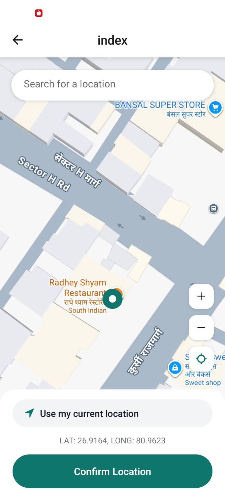
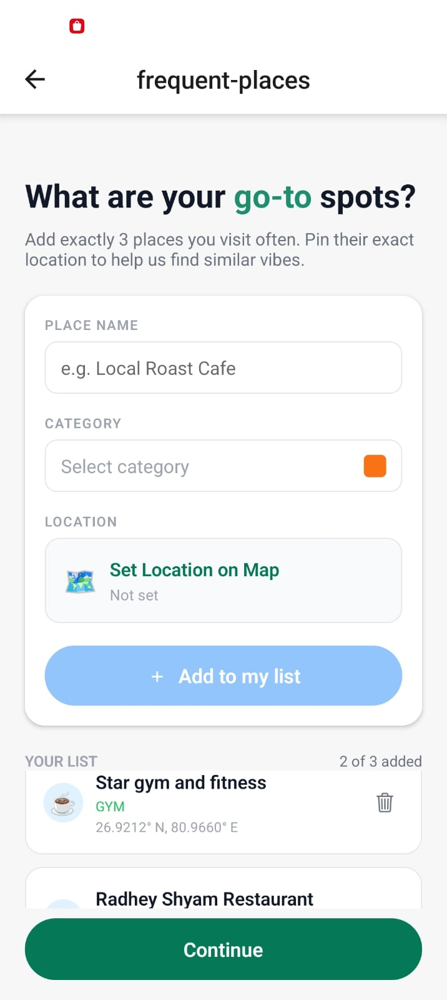
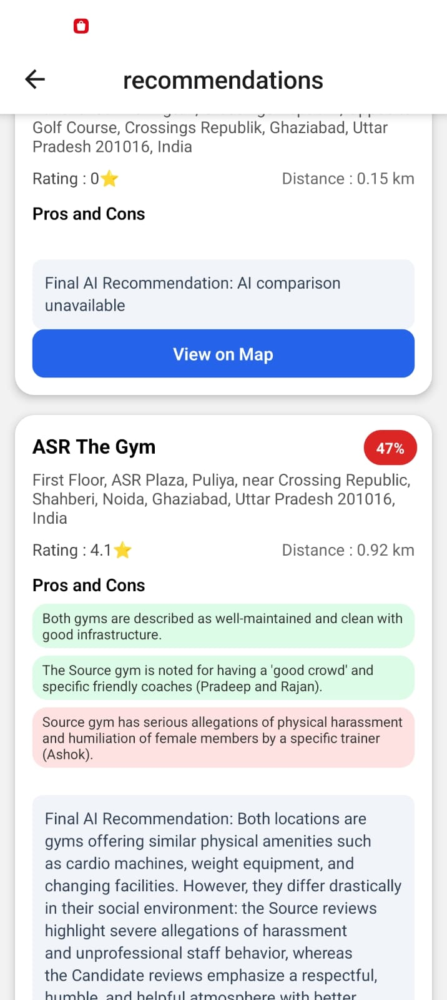

#  Team Name- Code_Assasins
  Shreyansh Gupta/
  Rishabh Pandey/
  Nitin Chugh/
  Nishkarsh Pandey/
# 🌍 MoveWise — Smart Relocation-Based Place Recommendation System

MoveWise is an intelligent, AI-powered application that helps users seamlessly adapt to a new city by recommending places (gyms, cafes, hospitals, restaurants, etc.) that closely match the places they already trust in their previous city.

The system combines **geospatial distance analysis**, **Google Places data**, and **Gemini AI–based comparison** to deliver accurate, relevant, and personalized recommendations through a clean and intuitive mobile app interface.

---

## 🔗 Important Links

- 📱 **App Demo (Download APK)**  
  https://expo.dev/artifacts/eas/8LHXFDYxg21jmTDW99r5M3.apk

- 🎥 **Video Demo (Walkthrough + Explanation)**  
  https://drive.google.com/file/d/1L24Uv981x_W-3gZUd3rcpYDEhkRxjX1h/view?usp=drive_link

- 📦 **GitHub Repository**  
  https://github.com/rishabh1230/HackXIndia-Hackathon-2026

---

## 🧠 Project Overview

When users relocate to a new city, they often want places similar to what they used earlier:

- A gym like their old gym  
- A cafe with similar ambience  
- A hospital with comparable services  
- A restaurant with similar quality and reviews  

MoveWise solves this by **understanding the user’s past behavior** and **replicating that experience** in the new city using real-world data and AI reasoning.

---

## ❓ Problem Statement

Traditional map-based search systems:

- Show generic nearby places  
- Do not consider what the user liked earlier  
- Ignore distance familiarity  
- Lack intelligent comparison  

As a result, users must manually search, compare, and experiment again.

---

## 💡 Why MoveWise?

MoveWise:

- Learns from the user’s previous city  
- Uses trusted places as reference points  
- Applies distance-based logic  
- Uses AI to compare quality and services  
- Delivers ranked recommendations instantly  

---

## 🧩 Core Idea

> **“If a user liked a place in their old city, show them similar or better places in the new city.”**

---

## 🔄 High-Level Workflow

1. User enters:
   - Previous city  
   - Current city  
   - One or more trusted source places  
2. Backend fetches details of source places  
3. Distance from source place to previous city is calculated  
4. Same distance radius is applied in the current city  
5. Similar places are fetched using Google Places API  
6. Gemini AI compares old vs new places  
7. Best matches are ranked and returned  
8. Frontend displays results in a clean UI  

---

# 🌍 MoveWise — End-to-End Workflow (Step-by-Step Visual Guide)

This section explains the **complete internal working of MoveWise** in a **clear, step-by-step format**.

> ⚠️ Focuses on **logic and flow only** — no raw JSON inputs shown.

---

## 🧩 STEP 1 — Capture User Relocation Context

### What happens

- The mobile app collects:
  - Previous city  
  - Current city  
  - Trusted places from the old city  
- This defines the user’s **lifestyle reference**
- Backend validates and normalizes the data

### Why this matters

- Enables personalized recommendations  
- Prevents generic results  
- Forms the base for all comparisons  

### Backend responsibility

- Validate required fields  
- Normalize coordinates  
- Prepare data for analysis  

  

---

## 🧩 STEP 2 — Analyze Source Place & Calculate Travel Radius

### What happens

- Backend fetches details of the trusted place  
- Calculates how far the user used to travel  
- This distance becomes the **comfort travel radius**

### Logic used

- Primary: Google Distance Matrix API  
- Fallback: Haversine (great-circle) distance  

### Why this matters

- Preserves past user behavior  
- Avoids unrealistic recommendations  
- Makes relocation feel familiar  

  

---

## 🧩 STEP 3 — Discover Similar Places in the New City

### What happens

- Backend searches near the new city using the same radius  
- Filters by:
  - Category (gym, cafe, hospital, etc.)  
  - Relevance and quality  

### Data fetched

- Place name  
- Ratings  
- Review count  
- Coordinates  
- Popularity indicators  

  

---

## 🧩 STEP 4 — AI-Based Comparison & Ranking

### What happens

- Each new place is compared with the original one  
- Gemini AI evaluates:
  - Distance similarity  
  - Ratings & reviews  
  - Services & amenities  
- AI generates:
  - Match score  
  - Short reasoning  
- Places are ranked from best to least suitable  

### Why AI is critical

- Traditional filters can’t judge experience similarity  
- AI understands qualitative differences  
- Produces human-like reasoning  

  

---

## 🧩 STEP 5 — Deliver Clean Results to the User

### What happens

- Backend sends ranked results to the app  
- Frontend displays:
  - Place cards  
  - Distance badges  
  - Ratings  
  - AI match score  
  - Explanation text  

### Why this matters

- Reduces decision fatigue  
- Builds trust  
- Improves user confidence  

  

---

## ✅ Complete Flow Summary

1. Capture relocation context  
2. Analyze trusted place & calculate distance  
3. Search similar places in new city  
4. Compare using AI & rank results  
5. Present clean recommendations to the user  

---

## 🏁 Final Note

**MoveWise** transforms relocation from a frustrating search process into a **smart, personalized experience** by combining:

- Geospatial intelligence  
- Real-world place data  
- AI-powered reasoning  

> **Helping users feel at home — wherever they move.**
